# Алгоритмы сортировки строк

### Генератор строк (StringGenerator)

Реализация класса и его хедер файл находтся в папке `StringGenerator`

## Алгоритмы сортировок

Реализации всех алгоритмов находтся в папке `SortingAlgorithms/`

- Quick Sort (`quicksort.hpp`) --- стандартная реализация Quick Sort с первым опорным элементом;
- Merge Sort (`mergesort.hpp`) --- стандартная реализация Merge Sort;
- String Quick Sort (`string_quicksort.hpp`) --- специализированная версия тернарного Quick Sort для строк (опорный элемент -- первый символ первой строки)
    Алгоритм использует in-place сортировку;
- String Merge Sort (`string_mergesort.hpp`) --- специализированная версия Merge Sort для строк;
    Алгоритм использует LCP Compare для сравнений префиксов строк;
- Regular MSD Radix Sort (`msd_radixsort.hpp`) --- Стандартная реализация MSD Radix Sort с дополнительной памятью под `Bucket`ы;
- Hybrid MSD Radix Sort (with Quick Sort) (`msd_radixsort.hpp`) --- Опитимизированная реализация MSD Radix Sort с переключением на QuickSort, при длине общего префикса превышающей размер массива.

## main.cpp

Точка входа, позволяющая запускать генерацию тест кейсов и сортировки с замерами.

```
Usage of ./bin/main: ./bin/main [command] [options]
Commands:
  gen           Generate test data
  sort          Sort data
Options:
  -h, --help            Show this help message
Algorithms:
  Quicksort                      - qs
  Mergesort                      - ms
  String Quicksort               - sqs
  String Mergesort               - sms
  MSD Radixsort (w/o qs)         - msd
  MSD Radixsort (w/ qs)          - mqs
```

Для генерации необходимо исопльзовать команду `gen`:
```
Usage of command gen: ./bin/main gen [options]
Options:
  -h, --help                    Show this help message
  -s, --seed                    Seed for generating test cases
  -o, --output                  Output file
```

Для запуска и замера времени какой-либо сортировки необходимо использовать команду `sort`:
```
Usage of command sort: ./bin/main sort [options]
Options:
  -h, --help                    Show this help message
  -a, --algorithm               Select sorting algorithm
  -n, --number                  Number of tries
  -i, --input                   Input file
  -o, --output                  Output file
```

### Пример использования программы:
```bash
$ ./main gen -s 69 -o 69.in
$ ./main sort -a qs 0n 5 -i 69.in -o qs_69.out
```

Формат выходного файла замеров сортировки:
```
/ regular
/ 100:
83 12533
77 12533
90 12533
81 12533
73 12533

/ regular
/ 200:
234 41115
231 41115
233 41115
202 41115
219 41115

...

/ almost sorted
/ 3000:
...

/ regular
/ 100:
list
of
sorted
strings
...
```

В начале идут блоки для каждого тест кейса (`regular`, `reverse sorted`, `almost sorted`).

Каждый блок --- название тест кейса, размер массива, а затем набор пар

    {время в микросекундах} {количество посимвольных сравнений}

для каждой попытки запуска.

В конце файла идут блоки с отсортированными строками для каждого тест кейса.

## plot.py

Скрипт для генерации графиков замеров

Пример использования:
```bash
$ python plot.py sort_results/qs_30.in
```

На выходе в папке `images/` появятся файлы `qs_30_*.png` с графиками времени и количества сравнений для каждого тест кейса.

## Компиляция, генерация и тестирование

Собрать программу, запустить генерацию и замеры для каждой из сортировок можно при помощи мейк-файла:

- `make` --- собрать программу
- `make gen` --- генерация тестовых данных

    Предварительно можно указать переменные окружения `SORT_SEED` и `TEST_CASE_NAME`
- `make test` --- тестирование каждой из сортировок

    Предварительно можно указать переменные окружения `SORT_TRIES`, `TEST_CASE_NAME` и `SORT_ALGORITHMS`
- `make clean` --- удалить все сгенерированные файлы, включая изображения графиков


# Анализ алгоритмов

## Классический Quick Sort
Исходные данные:

* `test_cases/test_cases_1337.in` --- сгенерированные данные
* `sort_results/qs_30.out` --- результаты замеров и сортировок
* Количество попыток на каждую сортировок: __30__

| | |
|:-------------------------:|:-------------------------:|
|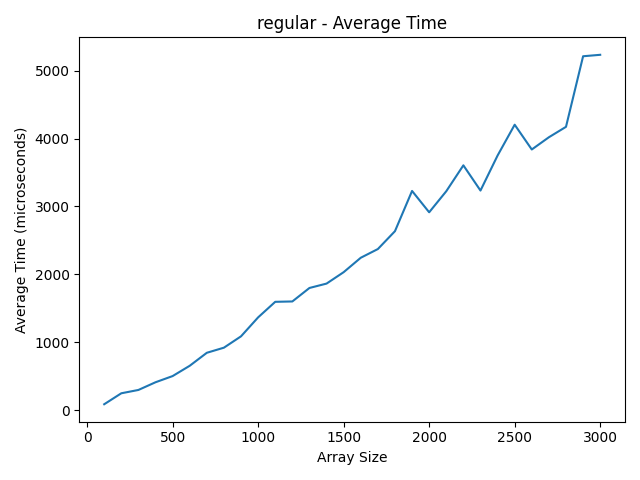 | 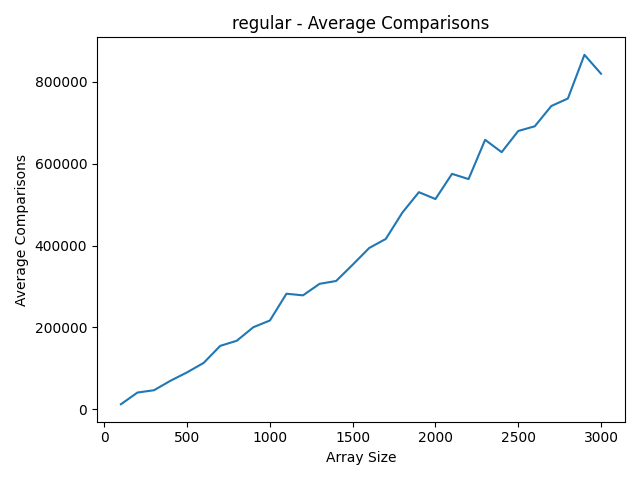|
| Среднее время на абсолютно случайном массиве | Среднее количество посимвольных сравнений на асболютно случайном массиве |
| | |
| Среднее время на обратно отсортированном массиве | Среднее количество посимвольных сравнений на обратно отсортированном случайном массиве |
| | |
| Среднее время на обратно отсортированном массиве | Среднее количество посимвольных сравнений на обратно отсортированном случайном массиве |

Как видим, в случайном случае классический Quick Sort справляется очень хорошо, однако при обратно отсортированном массиве, количество посимвольных сравнений становится очень большим.

В случае почти отсортированного массива видно, что проблема может быть так же и в выборе опорного элемента.

## Классический Merge Sort

Исходные данные:

* `test_cases/test_cases_1337.in` --- сгенерированные данные
* `sort_results/ms_30.out` --- результаты замеров и сортировок
* Количество попыток на каждую сортировок: __30__

| | |
|:-------------------------:|:-------------------------:|
|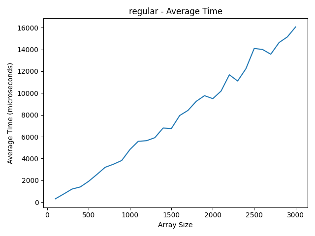 | 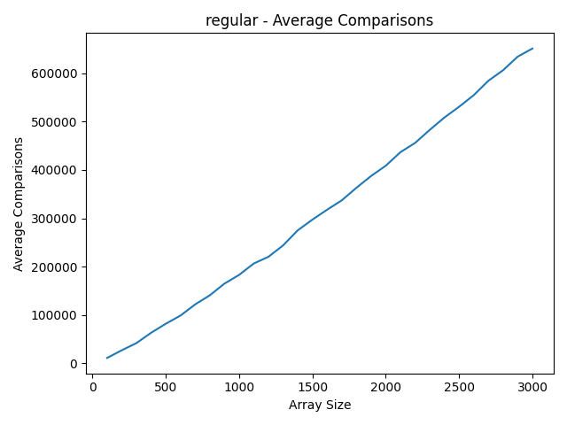|
| Среднее время на абсолютно случайном массиве | Среднее количество посимвольных сравнений на асболютно случайном массиве |
| | |
| Среднее время на обратно отсортированном массиве | Среднее количество посимвольных сравнений на обратно отсортированном случайном массиве |
| | |
| Среднее время на обратно отсортированном массиве | Среднее количество посимвольных сравнений на обратно отсортированном случайном массиве |

Как видим, по вермени Merge Sort работает стабильно во всех тест кейсах и примерно в 3-4 раза хуже, чем QuickSort, однако на reverse sorted случае сильно обыгрывает.

Также можно заметить, что количество посимвольных сравнений сильно меньше.


## String Quick Sort

Исходные данные:

* `test_cases/test_cases_1337.in` --- сгенерированные данные
* `sort_results/sqs_30.out` --- результаты замеров и сортировок
* Количество попыток на каждую сортировок: __30__

| | |
|:-------------------------:|:-------------------------:|
|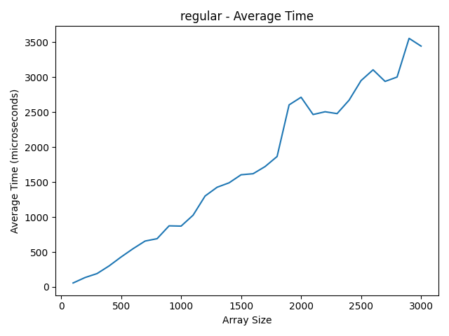 | 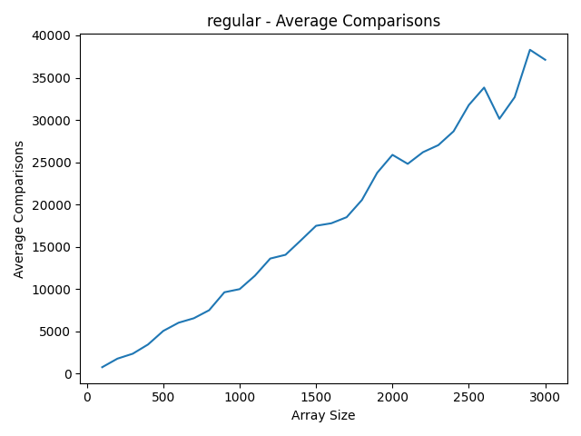|
| Среднее время на абсолютно случайном массиве | Среднее количество посимвольных сравнений на асболютно случайном массиве |
| | |
| Среднее время на обратно отсортированном массиве | Среднее количество посимвольных сравнений на обратно отсортированном случайном массиве |
| | |
| Среднее время на обратно отсортированном массиве | Среднее количество посимвольных сравнений на обратно отсортированном случайном массиве |

Как видим, String Quick Sort работает гораздо стабильнее Quick Sort, при этом количество сравнений в 10ки раз меньше, а время в 2 раза меньше.

## String Merge Sort

Исходные данные:

* `test_cases/test_cases_1337.in` --- сгенерированные данные
* `sort_results/sms_30.out` --- результаты замеров и сортировок
* Количество попыток на каждую сортировок: __30__

| | |
|:-------------------------:|:-------------------------:|
|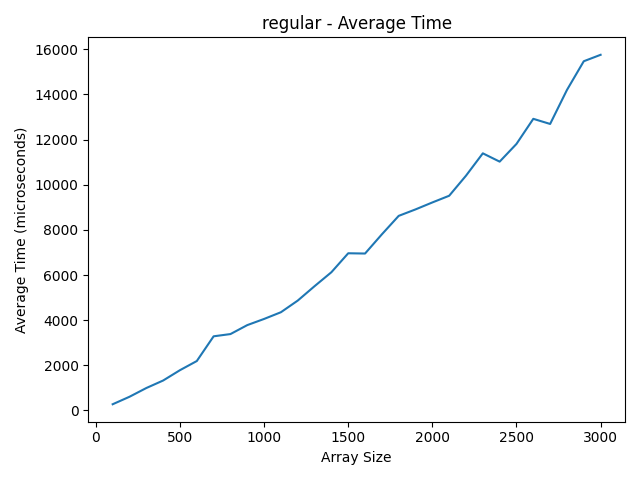 | 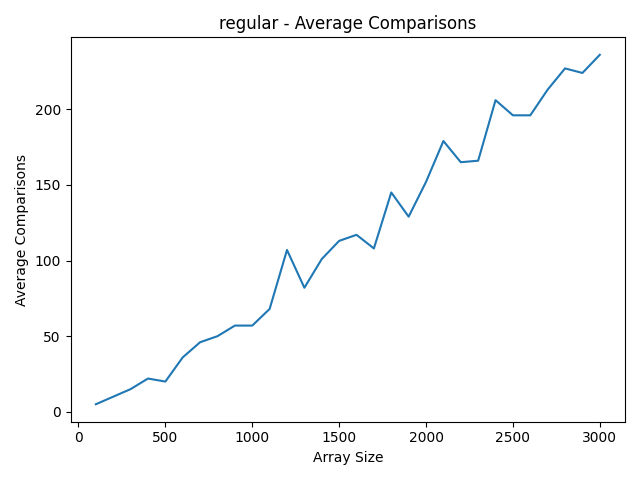|
| Среднее время на абсолютно случайном массиве | Среднее количество посимвольных сравнений на асболютно случайном массиве |
| | |
| Среднее время на обратно отсортированном массиве | Среднее количество посимвольных сравнений на обратно отсортированном случайном массиве |
| | |
| Среднее время на обратно отсортированном массиве | Среднее количество посимвольных сравнений на обратно отсортированном случайном массиве |

Как видим, по вермени String Merge Sort почти ничем не отличается от Merge Sort, однако количество посимвольных сравнений в 10ки раз меньше всех вышепредставленных сортировок. То есть операция слияния влияет ключевую роль во времени исполнения. Возможно при включении дополнительных оптимизаций, можно добиться лучших результатов.

## MSD Radix Sort

Исходные данные:

* `test_cases/test_cases_1337.in` --- сгенерированные данные
* `sort_results/msd_30.out` --- результаты замеров и сортировок
* Количество попыток на каждую сортировок: __30__

| | |
|:-------------------------:|:-------------------------:|
|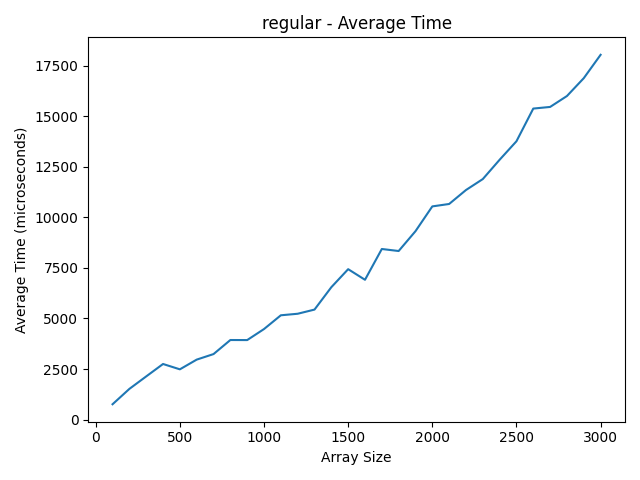 | 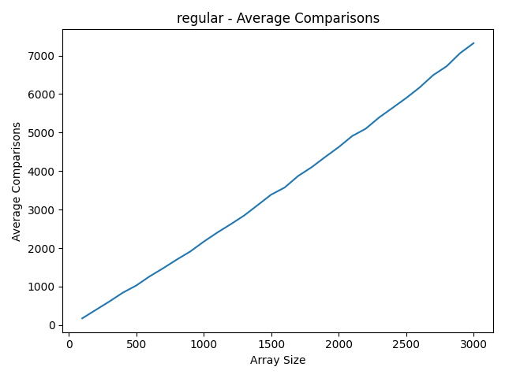|
| Среднее время на абсолютно случайном массиве | Среднее количество посимвольных сравнений на асболютно случайном массиве |
| | |
| Среднее время на обратно отсортированном массиве | Среднее количество посимвольных сравнений на обратно отсортированном случайном массиве |
| | |
| Среднее время на обратно отсортированном массиве | Среднее количество посимвольных сравнений на обратно отсортированном случайном массиве |

Как видим, MSD Radix Sort работает очень стабильно во всех тест кейсах, имеет маленькое количество посимвольных сравнений, однако во времени примерно сравним с Merge Sort и String Merge Sort. Это может быть связанно с тем, что использование дополнительной памяти в виде хэш-таблицы сильно замедляет алгоритм. Возможно, при использовании других структур данных и оптимизаций компилятора, можно добиться лучших результатов.


## MSD Radix Sort с использованием QuickSort

Исходные данные:

* `test_cases/test_cases_1337.in` --- сгенерированные данные
* `sort_results/mqs_30.out` --- результаты замеров и сортировок
* Количество попыток на каждую сортировок: __30__

| | |
|:-------------------------:|:-------------------------:|
|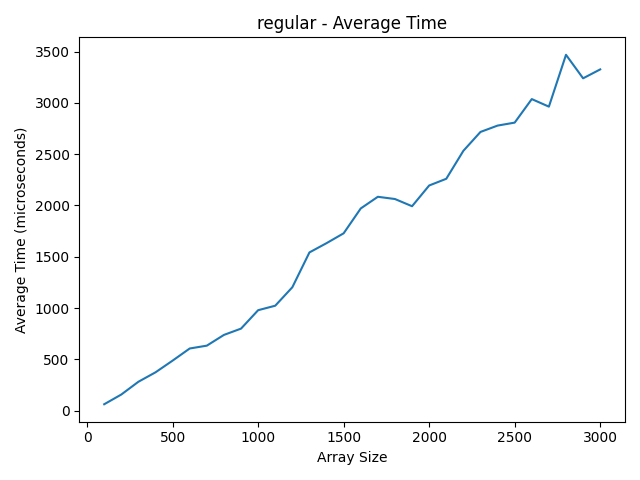 | 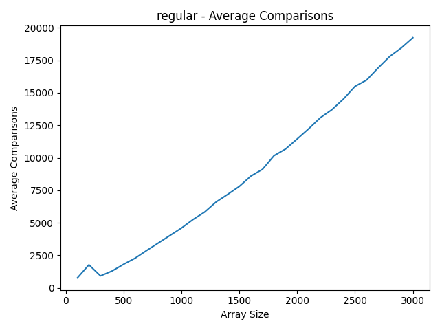|
| Среднее время на абсолютно случайном массиве | Среднее количество посимвольных сравнений на асболютно случайном массиве |
| | |
| Среднее время на обратно отсортированном массиве | Среднее количество посимвольных сравнений на обратно отсортированном случайном массиве |
| | |
| Среднее время на обратно отсортированном массиве | Среднее количество посимвольных сравнений на обратно отсортированном случайном массиве |

Как видим, гибридный MSD Radix Sort справляется лучше всех по времени, однако имеет немного больше сравнений (приемлимое количество) из-за переключения на String Quick Sort. Данный вид сортироваки также очень стабильный во всех тест кейсах.
